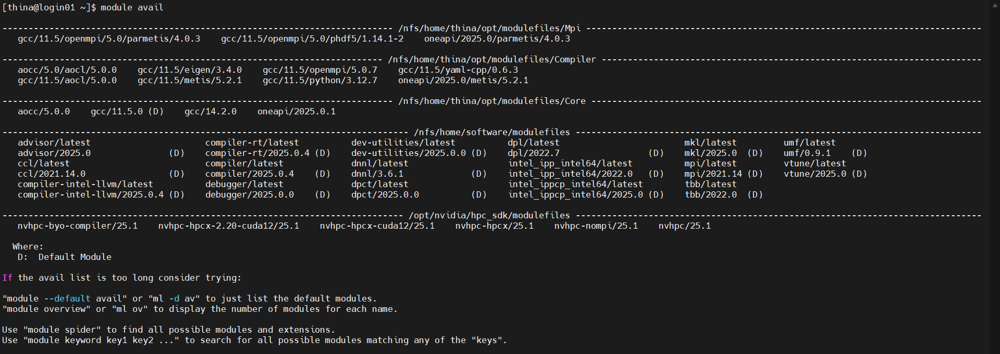

# Environment Management with Lmod

1. [Lmod Introduction](#what-is-lmod)
1. [Installing Lmod](#installing-environment-manager-lmod)
    1. [Ansible prerequisites script](#ansible-installation)
    1. [Main bash script](#bash-script-installation)
1. [Using Lmod](#using-lmod)
1. [Writing Modulefiles](#creating-modulefiles-lua-and-tcl)
    1. [Lua modulefile example](#some-common-lua-functions)
    1. [Lua Functions](#some-common-lua-functions)
    1. [Tcl functions](#tcl-modulefile-example)
    1. [Tcl Functions](#some-common-tcl-functions)


# What is Lmod?

Lmod is a Lua based module system that easily handles the `MODULEPATH` Hierarchical problem. Environment Modules provide a convenient way to dynamically change the users’ environment through modulefiles. This includes easily adding or removing directories to the PATH environment variable. Modulefiles for Library packages provide environment variables that specify where the library and header files can be found.

**Documentation:** https://lmod.readthedocs.io/en/latest/ <br>
**GitHub:** https://github.com/TACC/Lmod <br>
**SourceForge:** https://lmod.sf.net <br>
**TACC Homepage:** https://www.tacc.utexas.edu/research-development/tacc-projects/lmod


# Installing Environment Manager: Lmod
Understanding the utility and convince of scripting, two scripting methods will be used. Run the first [ansible script](#ansible-installation) across all nodes **then** run the bash script from your head node (depending on the file system).

## Ansible installation

1. Create inventory file and create the an ansible script `setup_Lmod_Ansible.yml`. It may start as follows,
    ```yml
    ---
    - name: Install Lmod Dependencies on All Nodes
    hosts: all
    become: yes
    tasks:
        - name: Install EPEL release
        dnf:
            name: epel-release
            state: present
    ```

2. Write to file `setup_Lmod_All.yml` so it installs all necessary prerequisite packages on all nodes as well as write `/etc/profile.d/lmod.sh` source script for each node. See [bash script](#bash-script-installation) installation to see list of prerequisites<br>

    > Using `export` command uses volatile memory, applying the changes to the environment variables will only be applied to current shell and not be kept when a new shell is launched. To make changes permanent, add the lines to `~/.bashrc`, `~/.bash_profile` or any `.profile` file hence writing `/etc/profile.d/lmod.sh`.

3. Run `setup_Lmod_All.yml` using command below.

    ```bash
    ansible-playbook -i inventory playbooks/setup_Lmod_All.yml --ask-become-pass
    ```
    `--ask-become-pass` is to allow root privileges for sudo commands.

    This does not mean Lmod is setup yet, now the bash script must be executed.

## Bash script installation
It is recommended that you include a section in your bash script that will execute the ansible script. **This is a task for you to do.**

0. This step should be done by the ansible script but this a list of prerequisites and lmod dependencies.
    ```bash
    sudo dnf install epel-release -y
    sudo dnf install git gcc make -y
    sudo dnf install tcl-devel tcl tcllib  bc -y
    sudo dnf install lua lua-posix lua-term lua-filesystem -y
    sudo dnf --enablerepo=devel install lua-devel -y
    ```
    If lmod was installed in a directory accessible by all nodes, `lua-filesystem` must be installed and must `/etc/profile.d/lmod.sh` written for each node.

1. Clone the repository
    ```bash
    cd $DOWNLOAD_DIR
    git clone https://github.com/TACC/Lmod.git
    cd Lmod
    ```

2. Configure, build and install
    ```bash
    ./configure --prefix=$BUILD_DIR  # example BUILD_DIR="$HOME/software"
    make -j$(nproc)
    make install
    ```

3. If profile script is not setup, here is an example extract how `/etc/profile.d/lmod.sh` may be written to in a bash script. The `module use --append` adds that directory modules to the front of the `MODULEPATH` environment variable; essentially the same as `export MODULEPATH=$BUILD_DIR/lmod/lmod/modulefiles:$MODULEFILES`.
    ```bash
    cat << EOF > "/etc/profile.d/lmod.sh"
    export PATH=$BUILD_DIR/lmod/$VERSION/libexec:\$PATH
    source $BUILD_DIR/lmod/lmod/init/bash
    module use --append $BUILD_DIR/lmod/lmod/modulefiles 
    module use --append /home/software/intel/modulefiles
    EOF
    ```
    Note `$BUILD_DIR` and be any directory but this guide will assume `$BUILD_DIR="/home/software"` were software is a user that every user has access to. And `$VERSION` is the Lmod version you are installing. You can check it [the TACC github](https://github.com/TACC/Lmod/releases) repository you will be cloning.

4. Source Lmod profile script
    ```bash
    source /etc/profile.d/lmod.sh
    ```


# Using Lmod

With Lmod installed, you'll now have some new commands on the terminal. Namely, these are: `module <subcommand>`. The important ones for you to know and use are: `module avail`, `module list`, `module load` and `module unload`. You can read more on Lmod Documentation - [User Guide for Lmod](https://lmod.readthedocs.io/en/latest/010_user.html). These commands do the following:

| Command                              | Shortened command                | Operation                                                          |
|--------------------------------------|----------------------------------|--------------------------------------------------------------------|
| `module avail`                       | `ml av`                          | Lists all modules that are available to the user.                  |
| `module list`                        | `ml`                             | Lists all modules that are loaded by the user.                     |
| `module load` **<module_name>**      | `ml` **<module_name>**           | Loads a module to the user's environment.                          |
| `module unload` **<module_name>**    | `ml -<module_name>`              | Removes a loaded module from the user's environment.               |
| `module show` **<module_name>**      | `ml show` **<module_name>**      | Displays functions executed by modulefile.                         |
| `module --raw show` **<module_name>**| `ml --raw show` **<module_name>**| Display text contents of modulefile including comments like `cat`. |
| `module savelist`                    | `ml savelist`                    | Lists user's saved collections.                                    |
| `module save` **<module_name>**      | `ml save` **<module_name>**      | Create list of currently loaded modules under `~/.config/lmod/<collection_name>`.|
| `module restore` **<module_name>**   | `ml restore` **<module_name>**   | Loads all modules listed in named collection.                      |
| `module describe` **<module_name>**  | `ml describe` **<module_name>**  | Prints list of saved module in collection.                         |
| `module disable` **<module_name>**   | `ml disable` **<module_name>**   | Disables collection and renames `foo` as `foo~`.                   |


> [!NOTE]
>
> Some installed packages will automatically add environment modules to the Lmod system, while others will not and will require you to manually add definitions for them. For example, the `Intel oneAPI Toolkits` package that we will install from source

Below is an example of Lmod in use<br>




# Creating Modulefiles (lua and tcl)
You can ask any AI of your choice to assist you in creating your modulefile but below are a few functions you may add/modify improve the utility of your modulefile.
Although Lmod reads modulefiles written in either Lua or TCL. Lmod has to interpret the TCL modulefiles into Lua and then evaluate the Lua file. So it is always faster to interpret Lua file rather than TCL files. The listed resources provide a list of useful functions in either language.

**Lua functions:** https://lmod.readthedocs.io/en/latest/050_lua_modulefiles.html
<br>

**Tcl functions:** https://lmod.readthedocs.io/en/latest/051_tcl_modulefiles.html

## Lua modulefile example
Lua modulefiles must have a `.lua` extension. This an example of a python lua modulefile; a similar [tcl modulefile example](#tcl-modulefile-example).
```lua
-- python 3.12.7 lua modulefile
-- Set local variables
local base = /home/software/gcc/14.2/python/3.12.7

-- Dependent modules
dependes_on("gcc/14.2.0")

-- Set environment variables
prepend_path("PATH", pathJoin(base, "bin"))
prepend_path("CPATH", pathJoin(base, "include"))
prepend_path("INCLUDE", pathJoin(base, "include"))
prepend_path("LIBRARY_PATH", pathJoin(base, "lib"))
prepend_path("LD_LIBRARY_PATH", pathJoin(base, "lib"))
prepend_path("PKG_CONFIG_PATH", pathJoin(base, "lib/pkgconfig"))
prepend_path("MANPATH", pathJoin(base, "share/man"))

-- Whatis description
whatis("Name: python")
whatis("Version: 3.12.7")
whatis("Category: programming language, scientific computing")

-- Help description
help([[
    This module loads python 3.12.7 in your environment.

    Installed in /home/software/gcc/14.2/python/3.12.7
    Configuration: ./configure CC=gcc CXX=g++ FC=gfortran --prefix=/home/software/gcc/14.2/python/3.12.7 --enable-optimizations --enable-shared
]])
```

## Some common Lua functions
Below are list of some of the lua functions to can use in you `<filename>.lua`. <br>

<details>
<summary>Defining module type using families</summary>

* **Module type/family:** A user can only have one family “name” loaded at a time. For example family(“compiler”) would mean that a user could only have one compiler loaded at a time. 

    ```lua
    family (“name”)
    ```

    > [!TIP]
    > 
    > family() can be use for preventing user from loading multiple compiler.
    >
    > For example: `gcc/14.2.0`, `aocc/5.0.0` and `oneapi/2025.0.1` modulefiles all contain the function `family("compiler")` thus, preventing user from loading intel, aocc and gcc in environment simultaneously.

</details>
<br>

<details>
<summary>Conflicts and dependencies between modules</summary><br>

* **Prerequisite:** The current modulefile will only load if all the listed modules are already loaded.

    ```lua
    prereq (“name1”, “name2”)
    ```
* **Dependencies:** Loads all modules. When unloading only dependent modules are unloaded.

    ```lua
    depends_on (“pkgA”, “pkgB”, “pkgC”)
    ```

* **Loading:** Load all modules listed. Report error if unable to load.
    ```lua
    load (“pkgA”, “pkgB”, “pkgC”)
    ```

* **If statement:** This is logic to allow conditional loading
    ```lua
    if (not isloaded(A)) then
        load(A)
    end
    ```

</details>

<br>

<details>
<summary>Modulefile path and environment modifying</summary>

* **Path concatenating:** Builds a path: “/a/b/c/d”, It combines any number of strings with one slash and removes excess slashes. Note that trailing slash is removed. If you need a trailing slash then do pathJoin(“/a”, “b/c”) .. “/” to get “/a/b/c/”.
    ```lua
    pathJoin (“/a”, “b/c/”, “d/”)
    ```

* **Path modification:** Prepend to a path-like variable the value.
    ```lua
    prepend_path (”PATH”, “/path/to/pkg/bin”)
    ```

* **Environment variable modification:** Assigns to the environment variable “NAME” the value. Do not use this function to assign the initial to a path-like variable. Use append_path or prepend_path instead.

    ```lua
    setenv (“NAME”, “value”)
    ```

    Sets NAME to value just like setenv. In addition it saves the previous value in a hidden environment variable. This way the previous state can be returned when a module is unloaded. pushenv (“FOO”,false) will clear “FOO” and the pop will return the previous value.
    ```lua
    pushenv (“NAME”, “value”)
    ```

</details>


## Tcl modulefile example
Unlike lua modulefiles tcl modulefiles do not need an extension. This an example of a python tcl modulefile; this module file is similar to the [lua example](#lua-modulefile-example).
```tcl
#%Module1.0
## python 3.12.7 TCL modulefile

# Set local variables
set base /home/software/gcc/14.2/python/3.12.7

# Load dependent modules
depends-on gcc/14.2.0

# Set environment variables
prepend-path PATH            $base/bin
prepend-path CPATH           $base/include
prepend-path INCLUDE         $base/include
prepend-path LIBRARY_PATH    $base/lib
prepend-path LD_LIBRARY_PATH $base/lib
prepend-path PKG_CONFIG_PATH $base/lib/pkgconfig
prepend-path MANPATH         $base/share/man

# Whatis descriptions
whatis "Name: python"
whatis "Version: 3.12.7"
whatis "Category: programming language, scientific computing"

# Help description
proc ModulesHelp { } {
    puts stderr "This module loads python 3.12.7 in your environment.\n"
    puts stderr "Installed in /home/software/gcc/14.2/python/3.12.7"
    puts stderr "Configuration: ./configure CC=gcc CXX=g++ FC=gfortran --prefix=/home/software/gcc/14.2/python/3.12.7 --enable-optimizations --enable-shared"
}
```

## Some common Tcl functions
Below are list of some of the tcl functions to can use in you `<filename>` or `<filename>.tcl`.
<br>

<details>
<summary>Defining module type using families</summary>

* **Module type/family:**A user can only have one family “name” loaded at a time. For example family(“compiler”) would mean that a user could only have one compiler loaded at a time.
    ```tcl
    family NAME
    ```
</details> <br>

<details>
<summary>Conflicts and dependencies between modules</summary><br>

* **Prerequisite:**The current modulefile will only load if any of the listed modules are already loaded.
    ```tcl
    prereq A B
    ```

* **Dependencies:** Loads all modules. When unloading only dependent modules are unloaded.
    ```tcl
    depends-on A B C
    ```

* **Loading:** This command loads all modules listed
    ```tcl
    module load A B
    ```
* **If statement:** This is logic to allow conditional loading
    ```tcl
    if {![is-loaded A]} {
        module load A
    }
    ```

</details>

<br>

<details>
<summary>Modulefile path and environment modifying</summary>

* **Path concatenating:** Prepend to a path-like variable the value.
    ```tcl
    prepend-path NAME path
    ```

* **Environment variable modification:**Assigns to the environment variable “NAME” the value
    ```tcl
    setenv NAME value
    ```

    Sets NAME to value just like setenv. In addition it saves the previous value in a hidden environment variable. This way the previous state can be returned when a module is unloaded
    ```tcl
    pushenv NAME value
    ```

</details>
